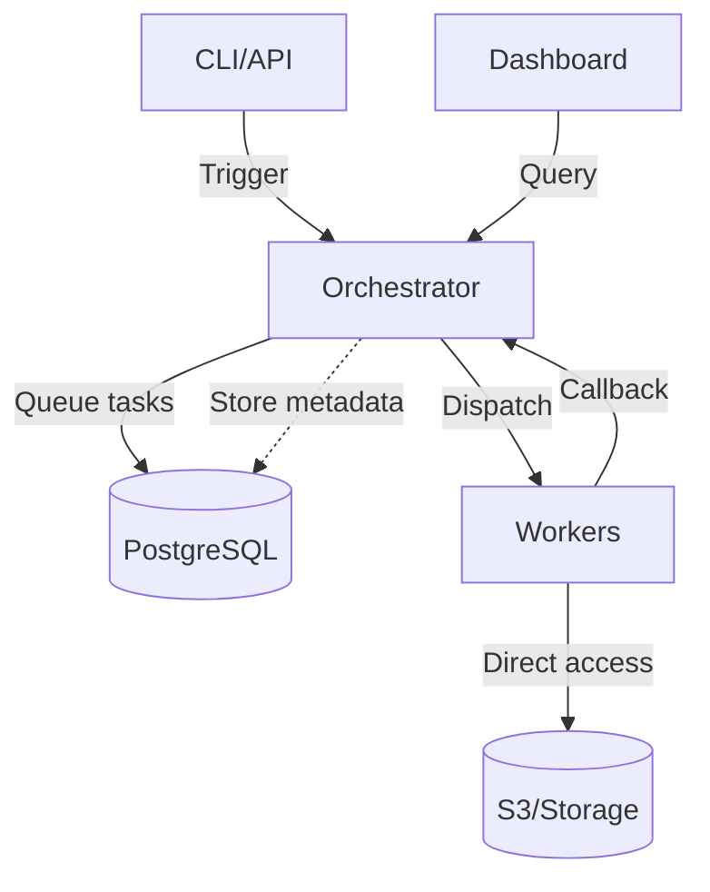

<div align="center">

```
╔════════════════════════════════════════════════════════════════════════╗
║                                                                        ║
║ ██████╗ ██╗██████╗ ███████╗██╗    ██╗███████╗ █████╗ ██╗   ██╗███████╗ ║
║ ██╔══██╗██║██╔══██╗██╔════╝██║    ██║██╔════╝██╔══██╗██║   ██║██╔════╝ ║
║ ██████╔╝██║██████╔╝█████╗  ██║ █╗ ██║█████╗  ███████║██║   ██║█████╗   ║
║ ██╔═══╝ ██║██╔═══╝ ██╔══╝  ██║███╗██║██╔══╝  ██╔══██║╚██╗ ██╔╝██╔══╝   ║
║ ██║     ██║██║     ███████╗╚███╔███╔╝███████╗██║  ██║ ╚████╔╝ ███████╗ ║
║ ╚═╝     ╚═╝╚═╝     ╚══════╝ ╚══╝╚══╝ ╚══════╝╚═╝  ╚═╝  ╚═══╝  ╚══════╝ ║
║                                                                        ║
║              Task Orchestration & Pipeline Management                  ║
╚════════════════════════════════════════════════════════════════════════╝
```

</div>

**A lightweight, debuggable task orchestration framework for serverless architectures**

Maintained by [Saritra GmbH](https://saritra.com) • Used in Production at [FirmIQ](https://firmiq.com)

[](https://opensource.org/licenses/MIT)

PipeWeave lets you build reliable, observable workflows that are **easy to debug locally** and **simple to deploy anywhere**. Define tasks as code, orchestrate complex pipelines, and get first-class observability out of the box.

## Why PipeWeave?

- **🐛 Local debuggability** — Set breakpoints in your IDE and step through task handlers like regular code
- **☁️ Deploy anywhere** — Cloud Run, Lambda, Kubernetes, or bare metal—your choice
- **📝 Code-first pipelines** — Define workflows in TypeScript with full type safety and IDE support
- **🔄 Built-in reliability** — Automatic retries, heartbeat monitoring, and dead letter queues
- **📊 Observable by default** — Track every task execution, view logs, and monitor pipeline health
- **📋 Input schemas** — Optional typed inputs with auto-generated UI forms and validation

## Documentation

- **[Getting Started](./docs/getting-started.md)** — Complete setup guide from zero to production
- **[Architecture](./docs/architecture.md)** — How PipeWeave works under the hood
- **[Configuration](./docs/configuration.md)** — Environment variables and tuning options
- **[Input Schemas](./docs/input-schemas.md)** — Define typed inputs with UI forms and validation
- **[Examples](./docs/examples.md)** — Real-world patterns and code samples
- **[API Reference](./SPEC.md)** — Complete API specification

## Packages

| Package                                            | Version                                                                                                               | Description                |
| -------------------------------------------------- | --------------------------------------------------------------------------------------------------------------------- | -------------------------- |
| [@pipeweave/sdk](./sdks/nodejs)                    | [](https://www.npmjs.com/package/@pipeweave/sdk)                   | Worker SDK for Node.js     |
| [@pipeweave/orchestrator](./packages/orchestrator) | [](https://www.npmjs.com/package/@pipeweave/orchestrator) | Task execution engine      |
| [@pipeweave/cli](./packages/cli)                   | [](https://www.npmjs.com/package/@pipeweave/cli)                   | Command line interface     |
| [@pipeweave/ui](./packages/ui)                     | [](https://www.npmjs.com/package/@pipeweave/ui)                     | Web monitoring dashboard   |
| [@pipeweave/shared](./packages/shared)             | [](https://www.npmjs.com/package/@pipeweave/shared)             | Shared types and utilities |

## Quick Start

### 1. Install

```bash
npm install @pipeweave/sdk
```

### 2. Define Tasks

```typescript
import { createWorker } from "@pipeweave/sdk";

const worker = createWorker({
  orchestratorUrl: "http://localhost:3000",
  serviceId: "my-service",
  secretKey: process.env.PIPEWEAVE_SECRET_KEY!,
});

// Simple task
worker.register("process", async (ctx) => {
  const { data } = ctx.input;
  return { processed: true, result: data.toUpperCase() };
});

// Task with routing
worker.register(
  "router",
  { allowedNext: ["path-a", "path-b"] },
  async (ctx) => {
    if (ctx.input.fast) {
      return { output: { routed: true }, runNext: ["path-a"] };
    }
    return { output: { routed: true }, runNext: ["path-b"] };
  }
);

worker.listen(8080);
```

### 3. Test Locally

```typescript
import { runLocal } from "@pipeweave/sdk";

const result = await runLocal(worker, "process", {
  input: { data: "hello" },
});

console.log(result.output); // { processed: true, result: 'HELLO' }
```

### 4. Set Up Database

Initialize the database schema using the CLI:

```bash
# Interactive setup wizard (recommended)
npx @pipeweave/cli setup

# Or manual migration
npx @pipeweave/cli db migrate --url postgresql://localhost:5432/pipeweave
```

### 5. Create Orchestrator Service

Create a file `orchestrator.ts`:

```typescript
import { createOrchestrator } from "@pipeweave/orchestrator";

const orchestrator = createOrchestrator({
  databaseUrl: "postgresql://localhost:5432/pipeweave",
  storageBackends: [
    {
      id: "local-dev",
      provider: "local",
      endpoint: "file://",
      bucket: "data",
      credentials: { basePath: "./storage" },
      isDefault: true,
    },
  ],
  secretKey: process.env.PIPEWEAVE_SECRET_KEY!,
  mode: "standalone",
  port: 3000,
});

await orchestrator.start();
const server = orchestrator.createServer();
await server.listen(3000, () => console.log("Orchestrator ready!"));
```

### 6. Run in Production

Start the orchestrator and trigger pipelines:

```bash
# Start your orchestrator service
npx tsx orchestrator.ts

# Trigger a pipeline via CLI
npx @pipeweave/cli trigger my-pipeline -i '{"data": "hello"}'

# Or via HTTP API
curl -X POST http://localhost:3000/api/pipelines/my-pipeline/trigger \
  -H "Content-Type: application/json" \
  -d '{"input": {"data": "hello"}}'
```

## Core Concepts

### Tasks

Self-contained units of work that process input and produce output:

```typescript
worker.register(
  "send-email",
  {
    retries: 3,
    retryBackoff: "exponential",
    idempotencyKey: (input, version) => `v${version}-${input.userId}`,
  },
  async (ctx) => {
    await emailService.send({
      to: ctx.input.email,
      subject: "Welcome!",
    });
    return { sent: true };
  }
);
```

### Pipelines

Directed acyclic graphs (DAGs) of tasks with dynamic routing:

```typescript
// Tasks define what can run next
worker.register("fetch", { allowedNext: ["validate", "transform"] }, ...);
worker.register("validate", { allowedNext: ["save"] }, ...);
worker.register("transform", { allowedNext: ["save"] }, ...);
worker.register("save", { allowedNext: [] }, ...); // End node
```

### Context Hydration

Each task receives full context including all upstream outputs:

```typescript
worker.register("summarize", async (ctx) => {
  // Access outputs from previous tasks
  const userData = ctx.upstream["fetch-user"].output;
  const orderData = ctx.upstream["fetch-orders"].output;

  return {
    summary: `${userData.name} has ${orderData.orders.length} orders`,
  };
});
```

## Features

### Reliability

- **Automatic retries** with exponential or fixed backoff
- **Heartbeat monitoring** to detect stuck tasks
- **Idempotency** to prevent duplicate execution
- **Dead letter queue** for manual intervention
- **Timeout handling** per task or globally

### Observability

- **Real-time dashboard** to monitor pipeline execution
- **Structured logging** for every task run
- **Progress reporting** for long-running tasks
- **Code versioning** to track task changes over time
- **Full audit trail** of all executions

### Developer Experience

- **Local testing** with `runLocal()` helper
- **TypeScript-first** with full type safety
- **IDE integration** with breakpoint debugging
- **Hot reload** in development mode
- **Simple deployment** with Docker or serverless

## Use Cases

- **Data pipelines** — ETL, data processing, batch jobs
- **Workflow automation** — User onboarding, order fulfillment, content moderation
- **Integration flows** — Connect APIs, sync data, handle webhooks
- **Scheduled jobs** — Reports, cleanups, notifications
- **Event-driven systems** — Process events from queues or streams

## Deployment Modes

### Standalone Mode

Orchestrator runs continuously with internal polling:

```typescript
const orchestrator = createOrchestrator({
  mode: "standalone",
  pollIntervalMs: 1000,
  // ...
});
```

**Best for:** VMs, containers, dedicated servers

### Serverless Mode

External scheduler triggers task processing on a regular interval (tick-based execution):

```typescript
const orchestrator = createOrchestrator({
  mode: "serverless",
  // No polling—triggered externally via POST /api/tick
});
```

The orchestrator processes tasks whenever it receives a tick request. Use a scheduler like **Cloud Scheduler** (GCP), **EventBridge** (AWS), or **cron** to trigger the `/api/tick` endpoint on your desired interval (e.g., every minute):

```bash
# Example: Trigger tick endpoint
curl -X POST https://your-orchestrator.run.app/api/tick \
  -H "Authorization: Bearer $PIPEWEAVE_SECRET_KEY"
```

**Best for:** Cloud Run, Lambda, AWS Fargate, or any serverless platform with external scheduling

## Architecture



**Key Design Decisions:**

- **Workers access storage directly** — No proxy overhead, better performance
- **PostgreSQL for metadata** — Proven reliability, rich query support
- **JWT-encrypted credentials** — Secure temporary storage access
- **HTTP-based communication** — Simple, debuggable, firewall-friendly

Learn more in the [Architecture Guide](./docs/architecture.md).

## Example: User Onboarding Pipeline

```typescript
// 1. Create account
worker.register(
  "create-account",
  { allowedNext: ["send-email", "setup-workspace"] },
  async (ctx) => {
    const user = await db.users.create(ctx.input);
    return { userId: user.id, email: user.email };
  }
);

// 2a. Send welcome email (runs in parallel with 2b)
worker.register(
  "send-email",
  { allowedNext: ["track-completion"] },
  async (ctx) => {
    const { email } = ctx.upstream["create-account"].output;
    await emailService.send({ to: email, template: "welcome" });
    return { sent: true };
  }
);

// 2b. Setup workspace (runs in parallel with 2a)
worker.register(
  "setup-workspace",
  { allowedNext: ["track-completion"] },
  async (ctx) => {
    const { userId } = ctx.upstream["create-account"].output;
    const workspace = await db.workspaces.create({ ownerId: userId });
    return { workspaceId: workspace.id };
  }
);

// 3. Track completion (join task—waits for both 2a and 2b)
worker.register("track-completion", { allowedNext: [] }, async (ctx) => {
  const { userId } = ctx.upstream["create-account"].output;
  await analytics.track(userId, "onboarding_completed");
  return { completed: true };
});
```

See more examples in the [Examples Guide](./docs/examples.md).

## Setup

### Prerequisites

- Node.js >= 18
- PostgreSQL 15+
- Storage backend (local filesystem, S3, GCS, or MinIO)

### Installation

```bash
# Clone repository
git clone https://github.com/SaritraGmbH/pipeweave.git
cd pipeweave

# Install and build
npm install
npm run build

# Setup database (interactive wizard)
npx @pipeweave/cli setup

# Or manually run migrations
npx @pipeweave/cli db migrate --url postgresql://localhost:5432/pipeweave
```

### Create Your Orchestrator

Create a file `my-orchestrator.ts`:

```typescript
import { createOrchestrator } from "@pipeweave/orchestrator";

const orchestrator = createOrchestrator({
  databaseUrl: process.env.DATABASE_URL!,
  storageBackends: [
    {
      id: "local-dev",
      provider: "local",
      endpoint: "file://",
      bucket: "data",
      credentials: { basePath: "./storage" },
      isDefault: true,
    },
  ],
  secretKey: process.env.PIPEWEAVE_SECRET_KEY!,
  mode: "standalone",
  port: 3000,
});

await orchestrator.start();
const server = orchestrator.createServer();
await server.listen(3000, () => console.log("Orchestrator ready!"));
```

See the [orchestrator-setup example](./examples/orchestrator-setup) for more configuration options.

### Start Services

```bash
# Start orchestrator
npx tsx my-orchestrator.ts

# Start UI (optional)
cd packages/ui && npm run dev
```

For detailed setup instructions, see the [Getting Started Guide](./docs/getting-started.md).

## Configuration

Minimal `.env` configuration:

```bash
# Database
DATABASE_URL=postgresql://localhost:5432/pipeweave

# Storage
STORAGE_BACKENDS='[{
  "id": "local-dev",
  "provider": "local",
  "endpoint": "file://",
  "bucket": "data",
  "credentials": {"basePath": "./storage"},
  "isDefault": true
}]'

# Security
PIPEWEAVE_SECRET_KEY=your-generated-secret-key
```

See the [Configuration Guide](./docs/configuration.md) for all options.

## Contributing

We welcome contributions! Please see [CONTRIBUTING.md](./CONTRIBUTING.md) for guidelines.

## Community

- **GitHub Issues** — Bug reports and feature requests
- **Discussions** — Questions and community support
- **Discord** — Real-time chat (coming soon)

## Roadmap

- [ ] Python SDK
- [ ] Cron/scheduled pipeline triggers
- [ ] Conditional task execution (skip logic)
- [ ] Sub-pipelines (nested workflows)
- [ ] GraphQL API
- [ ] Prometheus metrics exporter
- [ ] Terraform provider

## License

MIT © PipeWeave Contributors

---

**Ready to get started?** → [Getting Started Guide](./docs/getting-started.md)

**Need help?** → [GitHub Issues](https://github.com/SaritraGmbH/pipeweave/issues)
