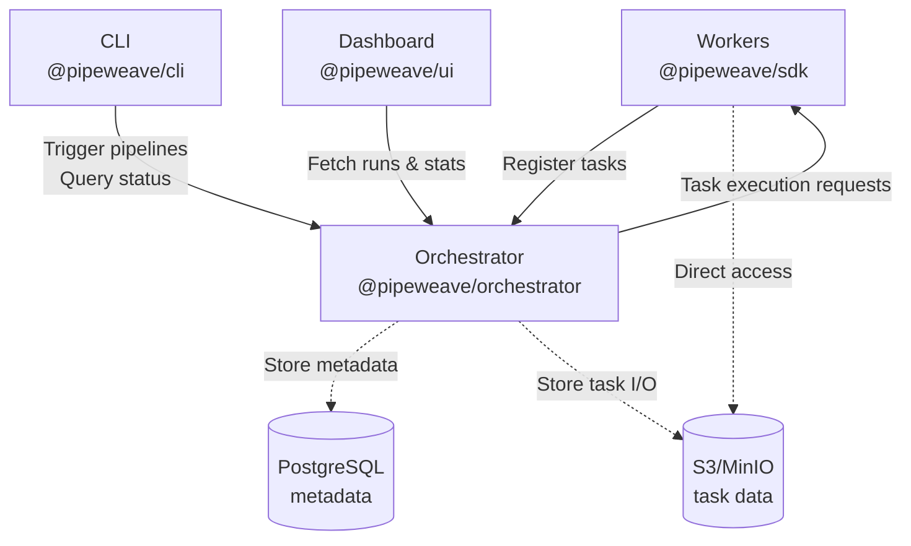
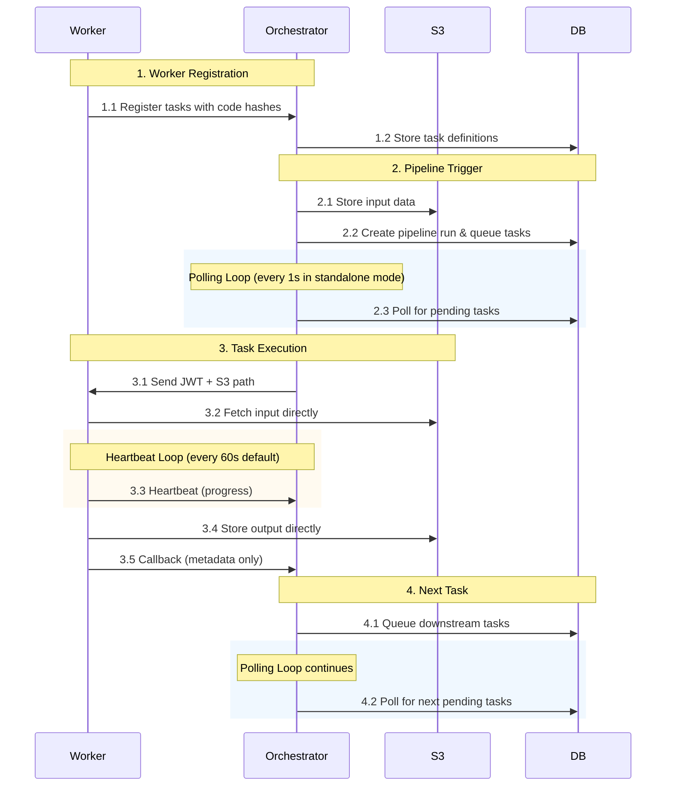

# PipeWeave

**A lightweight, debuggable task orchestration framework for serverless architectures**

[](https://opensource.org/licenses/MIT)

## Features

- **Local debuggability** — Set breakpoints in your IDE and step through task handlers
- **Serverless-first** — Deploy tasks anywhere (Cloud Run, Lambda, Kubernetes, bare metal)
- **Programmatic pipeline definition** — Define workflows in code with dynamic routing
- **Simple data passing** — Single hydrated context per task with automatic S3 persistence
- **Reliable execution** — Heartbeat monitoring, automatic retries, timeout handling

## Packages

| Package                                              | Description                                                       |
| ---------------------------------------------------- | ----------------------------------------------------------------- |
| [`@pipeweave/sdk`](./sdks/nodejs)                    | Worker SDK for Node.js — [docs](./sdks/nodejs/README.md)          |
| [`@pipeweave/orchestrator`](./packages/orchestrator) | Task execution engine — [docs](./packages/orchestrator/README.md) |
| [`@pipeweave/cli`](./packages/cli)                   | Command line interface — [docs](./packages/cli/README.md)         |
| [`@pipeweave/ui`](./packages/ui)                     | Web monitoring dashboard — [docs](./packages/ui/README.md)        |
| [`@pipeweave/shared`](./packages/shared)             | Shared types and utilities — [docs](./packages/shared/README.md)  |

## Quick Start

### Installation

```bash
npm install @pipeweave/sdk
```

### Define Tasks

```typescript
import { createWorker, TaskResult } from "@pipeweave/sdk";

const worker = createWorker({
  orchestratorUrl: "http://localhost:3000",
  serviceId: "my-service",
  secretKey: process.env.PIPEWEAVE_SECRET_KEY!,
});

// Simple task
worker.register("process", async (ctx) => {
  const { data } = ctx.input;
  return { processed: true, result: data.toUpperCase() };
});

// Task with programmatic next selection
worker.register(
  "router",
  {
    allowedNext: ["path-a", "path-b"],
  },
  async (ctx): Promise<TaskResult> => {
    if (ctx.input.fast) {
      return { output: { routed: true }, runNext: ["path-a"] };
    }
    return { output: { routed: true }, runNext: ["path-b"] };
  }
);

// Idempotent task
worker.register(
  "payment",
  {
    idempotencyKey: (input, codeVersion) => `v${codeVersion}-${input.orderId}`,
    retries: 3,
  },
  async (ctx) => {
    ctx.log.info(`Processing payment v${ctx.codeVersion}`);
    return { success: true };
  }
);

worker.listen(8080);
```

### Local Testing

```typescript
import { runLocal } from "@pipeweave/sdk";

const result = await runLocal(worker, "process", {
  input: { data: "hello" },
});

console.log(result.output); // { processed: true, result: 'HELLO' }
```

## Project Structure

```
pipeweave/
├── packages/
│   ├── shared/          # Shared types, constants, utilities
│   ├── orchestrator/    # Core execution engine
│   ├── cli/             # Command line tool
│   └── ui/              # Next.js web dashboard
├── sdks/
│   └── nodejs/          # Node.js SDK
├── examples/            # Example projects
└── docs/                # Documentation
```

## Setup Guide

### Prerequisites

- **Node.js >= 18** and **npm >= 9**
- **PostgreSQL** (for orchestrator database)
- **Storage Backend** (AWS S3, Google Cloud Storage, or MinIO)

### Architecture Overview

PipeWeave consists of several modules that work together:

1. **[@pipeweave/shared](./packages/shared)** — Shared types, constants, and utilities used by all packages
2. **[@pipeweave/sdk](./sdks/nodejs)** — Node.js SDK for creating worker services that execute tasks
3. **[@pipeweave/orchestrator](./packages/orchestrator)** — Core execution engine that manages pipelines and coordinates workers
4. **[@pipeweave/cli](./packages/cli)** — Command-line tool for triggering pipelines and managing the system
5. **[@pipeweave/ui](./packages/ui)** — Web dashboard for monitoring pipeline runs and task execution

### How They Work Together



**Data Flow:**



### Complete Setup

#### 1. Clone and Install

```bash
# Clone the repository
git clone https://github.com/pipeweave/pipeweave.git
cd pipeweave

# Install dependencies for all packages
npm install

# Build all packages (builds in dependency order)
npm run build
```

#### 2. Set Up Infrastructure

**PostgreSQL Database:**

```bash
# Using Docker
docker run -d \
  --name pipeweave-db \
  -e POSTGRES_DB=pipeweave \
  -e POSTGRES_USER=pipeweave \
  -e POSTGRES_PASSWORD=pipeweave \
  -p 5432:5432 \
  postgres:15

# Or install PostgreSQL natively and create database
createdb pipeweave
```

**Storage Backend:**

Choose one of the following storage backends:

**Option 1: MinIO (Recommended for development)**

```bash
# Using Docker
docker run -d \
  --name pipeweave-minio \
  -e MINIO_ROOT_USER=minioadmin \
  -e MINIO_ROOT_PASSWORD=minioadmin \
  -p 9000:9000 \
  -p 9001:9001 \
  minio/minio server /data --console-address ":9001"

# Create bucket via MinIO console at http://localhost:9001
# Or use mc CLI:
mc alias set local http://localhost:9000 minioadmin minioadmin
mc mb local/pipeweave
```

**Option 2: AWS S3**

Create an S3 bucket and IAM user with appropriate permissions.

**Option 3: Google Cloud Storage**

Create a GCS bucket and service account with Storage Admin role.

#### 3. Configure Environment

```bash
# Copy example environment file
cp .env.example .env

# Generate a secure secret key
openssl rand -hex 32

# Edit .env and set your values
# At minimum, configure:
# - DATABASE_URL
# - S3_* variables
# - PIPEWEAVE_SECRET_KEY (use the generated key above)
```

**Required variables:**

- `DATABASE_URL` — PostgreSQL connection string
- `STORAGE_BACKENDS` — JSON array of storage backend configurations, or use legacy single-backend variables (see below)
- `PIPEWEAVE_SECRET_KEY` — Shared encryption key (must be same on orchestrator and all workers)

**Storage Configuration Examples:**

```bash
# Multi-backend configuration (supports AWS S3, GCS, and MinIO simultaneously)
STORAGE_BACKENDS='[
  {
    "id": "primary-s3",
    "provider": "aws-s3",
    "endpoint": "https://s3.amazonaws.com",
    "bucket": "pipeweave-prod",
    "region": "us-east-1",
    "credentials": {
      "accessKeyId": "AKIA...",
      "secretAccessKey": "..."
    },
    "isDefault": true
  },
  {
    "id": "local-minio",
    "provider": "minio",
    "endpoint": "http://localhost:9000",
    "bucket": "pipeweave-dev",
    "credentials": {
      "accessKey": "minioadmin",
      "secretKey": "minioadmin"
    }
  }
]'
DEFAULT_STORAGE_BACKEND_ID=primary-s3

# OR use legacy single-backend configuration (backward compatible)
STORAGE_PROVIDER=minio  # or 'aws-s3' or 'gcs'
S3_ENDPOINT=http://localhost:9000
S3_BUCKET=pipeweave
S3_ACCESS_KEY=minioadmin
S3_SECRET_KEY=minioadmin
```

#### 4. Initialize Database

```bash
# Initialize database schema
npx @pipeweave/cli db init --url $DATABASE_URL

# Or if using npm scripts:
npm run build:packages  # Ensure CLI is built
node packages/cli/dist/index.js db init --url $DATABASE_URL
```

#### 5. Start the Orchestrator

```bash
# Development mode (with auto-reload)
npm run dev:orchestrator

# Or production mode
cd packages/orchestrator
npm run build
npm start

# The orchestrator will start on http://localhost:3000
```

#### 6. Create and Start a Worker Service

**Create a new worker project:**

```bash
# In a separate directory
mkdir my-worker && cd my-worker
npm init -y
npm install @pipeweave/sdk

# Create worker.ts
cat > worker.ts << 'EOF'
import { createWorker } from "@pipeweave/sdk";

const worker = createWorker({
  orchestratorUrl: process.env.PIPEWEAVE_ORCHESTRATOR_URL!,
  serviceId: "my-service",
  secretKey: process.env.PIPEWEAVE_SECRET_KEY!,
});

worker.register("hello", async (ctx) => {
  return { message: `Hello, ${ctx.input.name}!` };
});

worker.listen(8080);
EOF

# Start the worker
PIPEWEAVE_ORCHESTRATOR_URL=http://localhost:3000 \
PIPEWEAVE_SECRET_KEY=your-secret-key \
npx tsx worker.ts
```

The worker will automatically register its tasks with the orchestrator.

#### 7. Start the UI Dashboard (Optional)

```bash
# In the pipeweave repo root
npm run dev:ui

# The dashboard will start on http://localhost:4000
```

#### 8. Test Your Setup

```bash
# List registered services
npx @pipeweave/cli services --url http://localhost:3000

# Queue a test task
npx @pipeweave/cli trigger my-pipeline \
  -i '{"name": "World"}' \
  --url http://localhost:3000

# Check run status
npx @pipeweave/cli status <run-id> --url http://localhost:3000

# Or view in the dashboard
open http://localhost:4000
```

### Development Workflow

**Start everything in development mode:**

```bash
# Terminal 1: Start orchestrator
npm run dev:orchestrator

# Terminal 2: Start UI
npm run dev:ui

# Terminal 3: Start your worker service
cd path/to/your/worker
npm run dev

# Terminal 4: Use CLI to trigger pipelines
npx @pipeweave/cli trigger <pipeline-id> -i '{...}'
```

**Watch mode for all packages:**

```bash
# Run all packages in dev mode simultaneously
npm run dev
```

### Common Commands

```bash
# Build all packages
npm run build

# Build only core packages (shared, sdk, orchestrator, cli)
npm run build:packages

# Run all tests
npm test

# Type check all packages
npm run typecheck

# Lint all code
npm run lint

# Format all code
npm run format

# Clean build artifacts
npm run clean
```

## Architecture

For detailed architecture, API reference, and complete specification, see [SPEC.md](./SPEC.md).

## Documentation

See [SPEC.md](./SPEC.md) for the full specification.

## License

MIT © PipeWeave Contributors
