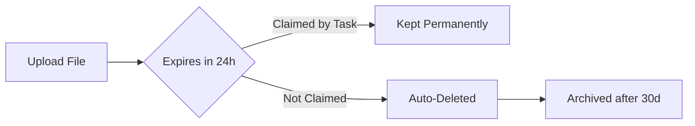

# Input Schemas

Input schemas allow you to define structured, validated input for your tasks. This feature enables:

- **Auto-generated UI forms** in the dashboard for triggering pipelines
- **Input validation** before task execution
- **Type safety** and better developer experience
- **File uploads** with automatic cleanup
- **Documentation** of task inputs

**Note:** Input schemas are completely **optional**. Tasks without schemas continue to work exactly as before.

---

## Quick Example

```typescript
import { createWorker } from "@pipeweave/sdk";

const worker = createWorker({
  orchestratorUrl: "http://localhost:3000",
  serviceId: "user-service",
  secretKey: process.env.PIPEWEAVE_SECRET_KEY!,
});

worker.register(
  "create-user",
  {
    allowedNext: ["send-welcome-email"],
    inputSchema: {
      fields: [
        {
          name: "email",
          type: "email",
          label: "Email Address",
          description: "User's primary email",
          required: true,
        },
        {
          name: "fullName",
          type: "string",
          label: "Full Name",
          required: true,
          minLength: 2,
          maxLength: 100,
        },
        {
          name: "accountType",
          type: "select",
          label: "Account Type",
          required: true,
          options: [
            { label: "Free", value: "free" },
            { label: "Pro", value: "pro" },
            { label: "Enterprise", value: "enterprise" },
          ],
          default: "free",
        },
        {
          name: "avatar",
          type: "file",
          label: "Profile Picture",
          accept: "image/*",
          maxSize: 5242880, // 5MB
        },
      ],
    },
  },
  async (ctx) => {
    const { email, fullName, accountType, avatar } = ctx.input;

    // Input is already validated
    const user = await createUser({ email, fullName, accountType });

    // If avatar was uploaded, it's a temp upload ID
    if (avatar) {
      await uploadAvatar(user.id, avatar);
    }

    return { userId: user.id };
  }
);
```

When you trigger this pipeline from the UI, a form is automatically generated with all the fields, validation, and a file upload component.

---

## Field Types

### Basic Types

#### `string`
Plain text input.

```typescript
{
  name: "username",
  type: "string",
  label: "Username",
  minLength: 3,
  maxLength: 20,
  pattern: "^[a-zA-Z0-9_]+$", // Regex validation
  placeholder: "Enter username"
}
```

#### `number` / `integer`
Numeric input.

```typescript
{
  name: "age",
  type: "integer",
  label: "Age",
  min: 18,
  max: 120,
  required: true
}
```

#### `boolean`
Checkbox or toggle.

```typescript
{
  name: "newsletter",
  type: "boolean",
  label: "Subscribe to newsletter",
  default: true
}
```

#### `textarea`
Multi-line text input.

```typescript
{
  name: "bio",
  type: "textarea",
  label: "Biography",
  maxLength: 500,
  placeholder: "Tell us about yourself..."
}
```

### Validation Types

#### `email`
Email address with validation.

```typescript
{
  name: "email",
  type: "email",
  label: "Email",
  required: true
}
```

#### `url`
URL with validation.

```typescript
{
  name: "website",
  type: "url",
  label: "Website"
}
```

#### `date` / `datetime`
Date picker.

```typescript
{
  name: "birthdate",
  type: "date",
  label: "Birth Date",
  required: true
}
```

### Selection Types

#### `select`
Dropdown menu.

```typescript
{
  name: "country",
  type: "select",
  label: "Country",
  required: true,
  options: [
    { label: "United States", value: "us" },
    { label: "United Kingdom", value: "uk" },
    { label: "Germany", value: "de" }
  ]
}
```

#### `multiselect`
Multiple selection.

```typescript
{
  name: "interests",
  type: "multiselect",
  label: "Interests",
  options: [
    { label: "Technology", value: "tech" },
    { label: "Sports", value: "sports" },
    { label: "Music", value: "music" }
  ]
}
```

### Complex Types

#### `file`
File upload with automatic cleanup.

```typescript
{
  name: "document",
  type: "file",
  label: "Upload Document",
  accept: ".pdf,.docx", // Or "application/pdf"
  maxSize: 10485760, // 10MB in bytes
  required: true
}
```

**How file uploads work:**
1. UI uploads file to `POST /api/upload/temp`
2. Returns upload ID (e.g., `tmp_abc123`)
3. Upload ID is passed as input value
4. Task claims upload when executed (prevents cleanup)
5. Unclaimed uploads are deleted after 24 hours

#### `array`
List of values.

```typescript
{
  name: "tags",
  type: "array",
  label: "Tags",
  items: {
    name: "tag",
    type: "string",
    label: "Tag"
  }
}
```

#### `object`
Nested object.

```typescript
{
  name: "address",
  type: "object",
  label: "Address",
  properties: [
    {
      name: "street",
      type: "string",
      label: "Street",
      required: true
    },
    {
      name: "city",
      type: "string",
      label: "City",
      required: true
    },
    {
      name: "zipCode",
      type: "string",
      label: "ZIP Code",
      required: true
    }
  ]
}
```

#### `json`
Free-form JSON editor.

```typescript
{
  name: "metadata",
  type: "json",
  label: "Additional Metadata"
}
```

---

## Conditional Fields

Show/hide fields based on other field values:

```typescript
{
  fields: [
    {
      name: "accountType",
      type: "select",
      label: "Account Type",
      options: [
        { label: "Personal", value: "personal" },
        { label: "Business", value: "business" }
      ]
    },
    {
      name: "companyName",
      type: "string",
      label: "Company Name",
      required: true,
      showIf: {
        field: "accountType",
        operator: "eq",
        value: "business"
      }
    }
  ]
}
```

**Supported operators:**
- `eq` — equals
- `ne` — not equals
- `gt` — greater than
- `lt` — less than
- `gte` — greater than or equal
- `lte` — less than or equal
- `in` — value in array
- `notIn` — value not in array

---

## Validation

### Automatic Validation

Input is automatically validated before task execution:

```bash
# Valid input
curl -X POST http://localhost:3000/api/pipelines/create-user/trigger \
  -d '{"input": {"email": "user@example.com", "fullName": "John Doe"}}'

# Invalid input (validation fails)
curl -X POST http://localhost:3000/api/pipelines/create-user/trigger \
  -d '{"input": {"email": "invalid-email", "fullName": "J"}}'

# Response: 400 Bad Request
{
  "error": "Input validation failed",
  "validationErrors": {
    "create-user": [
      {
        "field": "email",
        "message": "Invalid email address",
        "code": "invalid_string"
      },
      {
        "field": "fullName",
        "message": "Minimum length is 2",
        "code": "too_small"
      }
    ]
  }
}
```

### Validation Modes

Control validation behavior when triggering pipelines:

```bash
# Strict mode: Fail on validation errors (default in future versions)
curl -X POST http://localhost:3000/api/pipelines/create-user/trigger \
  -d '{"input": {...}, "validationMode": "strict"}'

# Warn mode: Log warnings but continue (current default)
curl -X POST http://localhost:3000/api/pipelines/create-user/trigger \
  -d '{"input": {...}, "validationMode": "warn"}'

# None: Skip validation entirely
curl -X POST http://localhost:3000/api/pipelines/create-user/trigger \
  -d '{"input": {...}, "validationMode": "none"}'
```

### Validate Endpoint

Test input validation without triggering:

```bash
curl -X POST http://localhost:3000/api/tasks/create-user/validate-input \
  -d '{"input": {"email": "test@example.com", "fullName": "Test User"}}'

# Response
{
  "valid": true,
  "errors": []
}
```

---

## Temporary File Uploads

### Upload API

```bash
# Upload a file
curl -X POST http://localhost:3000/api/upload/temp \
  -F "file=@document.pdf"

# Response
{
  "uploadId": "tmp_abc123xyz",
  "storagePath": "temp-uploads/tmp_abc123xyz/document.pdf",
  "filename": "document.pdf",
  "size": 102400,
  "mimeType": "application/pdf",
  "expiresAt": "2024-12-01T12:00:00Z"
}
```

### Upload Lifecycle



1. **Upload:** File stored in `temp-uploads/` prefix
2. **Expiration:** 24 hours from upload
3. **Claiming:** Task execution claims the upload (sets `claimed_by_run_id`)
4. **Cleanup:** Hourly job deletes unclaimed expired uploads
5. **Archive:** Database records deleted after 30 days

### Upload Management

```bash
# Get upload info
GET /api/upload/temp/:id

# Delete upload manually
DELETE /api/upload/temp/:id

# Get statistics
GET /api/upload/stats
{
  "total": 150,
  "expired": 5,
  "claimed": 120,
  "deleted": 25
}
```

---

## Strict Mode

Reject input with unknown fields:

```typescript
{
  fields: [...],
  strict: true  // Reject unknown keys
}
```

---

## Backward Compatibility

**Tasks without schemas work exactly as before:**

```typescript
// No schema = no validation (works as before)
worker.register("legacy-task", async (ctx) => {
  // Accept any input
  return { processed: true };
});

// Trigger with any JSON
POST /api/pipelines/legacy-task/trigger
{
  "input": { "anything": "goes" }
}
```

**Validation is opt-in:**
- If `inputSchema` is undefined → no validation
- If `inputSchema` is defined → validation applies
- Validation warnings don't block execution (unless `validationMode: "strict"`)

---

## UI Integration

When a task has an input schema, the UI automatically:

1. **Generates a form** with all fields
2. **Handles file uploads** with progress indicators
3. **Validates input** before submission
4. **Shows errors** inline with field labels
5. **Falls back to JSON editor** if no schema

Tasks without schemas continue to use the raw JSON editor.

---

## Best Practices

### 1. Start Simple

Add schemas to entry tasks first:

```typescript
// Start here
worker.register("pipeline-entry", {
  inputSchema: { ... },
  allowedNext: ["process"]
}, handler);

// Add schemas later
worker.register("process", {
  // No schema yet
  allowedNext: []
}, handler);
```

### 2. Use Defaults

Provide sensible defaults to reduce friction:

```typescript
{
  name: "sendEmail",
  type: "boolean",
  label: "Send Confirmation Email",
  default: true  // Most users want this
}
```

### 3. Add Help Text

Guide users with descriptions:

```typescript
{
  name: "apiKey",
  type: "string",
  label: "API Key",
  description: "Find this in Settings > API Keys",
  helpText: "Required for external service integration"
}
```

### 4. File Size Limits

Set reasonable file size limits:

```typescript
{
  name: "image",
  type: "file",
  accept: "image/*",
  maxSize: 5 * 1024 * 1024  // 5MB
}
```

### 5. Validate Patterns

Use regex for custom validation:

```typescript
{
  name: "phoneNumber",
  type: "string",
  pattern: "^\\+?[1-9]\\d{1,14}$",  // E.164 format
  placeholder: "+1234567890"
}
```

---

## API Reference

### Field Definition

```typescript
interface InputFieldDefinition {
  name: string;
  type: InputFieldType;
  label: string;
  description?: string;
  required?: boolean;
  default?: unknown;

  // String/Number validation
  minLength?: number;
  maxLength?: number;
  min?: number;
  max?: number;
  pattern?: string;

  // Select options
  options?: Array<{ label: string; value: unknown }>;

  // File constraints
  accept?: string;
  maxSize?: number;

  // Array/Object
  items?: InputFieldDefinition;
  properties?: InputFieldDefinition[];

  // Conditional visibility
  showIf?: {
    field: string;
    operator: ConditionalOperator;
    value: unknown;
  };

  // UI hints
  placeholder?: string;
  helpText?: string;
}
```

### Task Input Schema

```typescript
interface TaskInputSchema {
  fields: InputFieldDefinition[];
  strict?: boolean;
}
```

### Validation Result

```typescript
interface ValidationResult {
  valid: boolean;
  errors: ValidationError[];
  sanitized?: unknown;
}

interface ValidationError {
  field: string;
  message: string;
  code: string;
}
```

---

## Migration from Untyped Inputs

### Before (No Schema)

```typescript
worker.register("create-user", async (ctx) => {
  // Manual validation
  if (!ctx.input.email) {
    throw new Error("Email required");
  }
  if (!ctx.input.email.includes("@")) {
    throw new Error("Invalid email");
  }

  // ... create user
});
```

### After (With Schema)

```typescript
worker.register("create-user", {
  inputSchema: {
    fields: [
      {
        name: "email",
        type: "email",
        required: true
      }
    ]
  }
}, async (ctx) => {
  // Input already validated!
  const { email } = ctx.input;
  // ... create user
});
```

---

## Examples

See the [examples directory](../examples) for complete working examples:

- **User Registration** — Form with file upload
- **Data Processing** — Conditional fields and validation
- **Multi-step Workflow** — Complex nested objects

---

## Troubleshooting

### Schema not applied

**Problem:** Changes to input schema not reflected in UI.

**Solution:** Restart the worker service to re-register tasks with updated schemas.

### File upload fails

**Problem:** File upload returns 500 error.

**Solution:** Check storage backend configuration and permissions.

### Validation too strict

**Problem:** Valid input rejected.

**Solution:** Use `validationMode: "warn"` during migration, then fix validation rules.

---

## Next Steps

- [Getting Started Guide](./getting-started.md) — Setup instructions
- [API Reference](../SPEC.md) — Complete API documentation
- [Examples](./examples.md) — Real-world patterns
